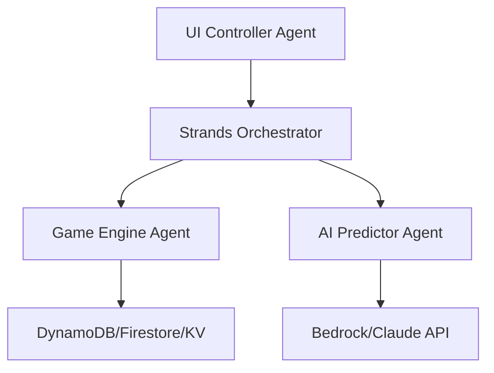

# Blog Snippets Generation Hook

## Purpose
Generate code snippets and documentation for AWS Builder Center blog post.

## Auto-Generated Content

### Architecture Diagrams


### Code Snippets

#### Agent Communication
```javascript
// Strands agent handoff example
const moveResult = await orchestrator.routeMessage(
  'ui-controller',
  'game-engine',
  { type: 'MOVE_PIECE', direction: 'down' }
);
```

#### Multi-Cloud Deployment
```yaml
# AWS SAM template snippet
Resources:
  TetrisGameFunction:
    Type: AWS::Serverless::Function
    Properties:
      Runtime: nodejs18.x
      Handler: src/lambda.handler
```

#### Security Implementation
```javascript
// Secret management example
const secrets = await getSecrets({
  aws: 'arn:aws:secretsmanager:region:account:secret:tetris-secrets',
  gcp: 'projects/project-id/secrets/tetris-secrets/versions/latest',
  vercel: process.env.TETRIS_API_KEY
});
```

### Performance Metrics
- Agent response times
- Multi-cloud latency comparison
- AI prediction accuracy
- Game performance benchmarks

### Screenshots
- Win95 theme gameplay
- Dark mode interface
- Replay system with AI annotations
- Multi-cloud deployment dashboard

## Blog Post Sections
1. **Introduction**: KIRO Challenge and Strands Agents
2. **Architecture**: Multi-agent design patterns
3. **Implementation**: Key code examples
4. **Security**: Guardrails and best practices
5. **Deployment**: Multi-cloud strategy
6. **Results**: Performance and lessons learned