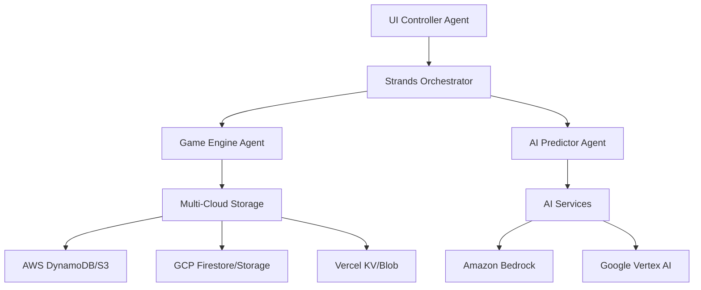

# KIRO Tetris AI - Multi-Agent Strands Architecture

[](https://aws.amazon.com/)
[](https://cloud.google.com/)
[](https://vercel.com/)
[](https://strands.dev/)

A modern Tetris game powered by AI and built with the Strands multi-agent framework. Features intelligent move prediction, adaptive difficulty, comprehensive replay system, and multi-cloud deployment capabilities.

## 🎮 Features

### Core Game
- **Classic Tetris**: 20x10 grid with 7 standard tetrominoes
- **Win95 Theme**: Authentic retro styling with dark mode toggle
- **Smooth Performance**: 60 FPS rendering with optimized collision detection
- **Progressive Difficulty**: 10 levels with adaptive speed

### AI Intelligence
- **Move Prediction**: AI suggests optimal piece placements
- **Board Analysis**: Real-time evaluation of game state
- **Adaptive Difficulty**: AI accuracy scales with player skill
- **Confidence Scoring**: Weighted predictions with uncertainty quantification

### Multi-Agent Architecture
- **Game Engine Agent**: Core game logic and state management
- **AI Predictor Agent**: Intelligent move analysis and suggestions
- **UI Controller Agent**: Rendering, themes, and user interaction
- **Orchestrator**: Coordinates agent communication and workflows

### Replay System
- **Full Recording**: Captures every move and game state
- **AI Annotations**: Intelligent commentary on gameplay decisions
- **Playback Controls**: Speed control, scrubbing, and frame-by-frame analysis
- **Performance Analytics**: Detailed statistics and improvement suggestions

## 🏗️ Architecture



## 🚀 Quick Start

### Prerequisites
- Node.js 18+
- npm 9+
- Cloud provider account (AWS/GCP/Vercel)

### Installation

```bash
# Clone the repository
git clone https://github.com/your-username/kiro-tetris-ai.git
cd kiro-tetris-ai

# Install dependencies
npm install

# Build the browser bundle
npm run build

# Copy environment configuration
cp config/secrets/.env.aws.example .env.aws
cp config/secrets/.env.gcp.example .env.gcp
cp config/secrets/.env.vercel.example .env.vercel

# Configure your cloud credentials
# Edit .env.aws, .env.gcp, .env.vercel with your actual values

# Run locally
npm run dev
```

### Environment Setup

#### AWS Configuration
```bash
# Set up AWS credentials
aws configure

# Create required resources
aws cloudformation deploy --template-file infrastructure/aws-sam.yaml --stack-name tetris-game
```

#### Google Cloud Configuration
```bash
# Authenticate with GCP
gcloud auth login
gcloud config set project YOUR_PROJECT_ID

# Deploy Cloud Functions
npm run deploy:gcp
```

#### Vercel Configuration
```bash
# Install Vercel CLI
npm i -g vercel

# Deploy to Vercel
npm run deploy:vercel
```

## 🎯 KIRO Challenge Implementation

This project demonstrates the KIRO (Keep It Running Optimally) methodology through:

### .kiro/ Directory Structure
```
.kiro/
├── specs/                 # EARS format requirements
│   ├── game-engine-spec.md
│   ├── ai-predictor-spec.md
│   ├── ui-controller-spec.md
│   ├── strands-orchestrator-spec.md
│   ├── security-guardrails-spec.md
│   └── multi-cloud-deployment-spec.md
├── hooks/                 # Automation hooks
│   ├── test-generation.md
│   ├── blog-snippets.md
│   ├── pre-commit-security.md
│   └── agent-handoff-validation.md
└── steering/              # Implementation guidelines
    ├── complex-logic-guidelines.md
    ├── performance-constraints.md
    ├── win95-ui-standards.md
    ├── strands-patterns.md
    └── security-guardrails.md
```

### Agent-Driven Development
- **Specification-First**: All agents defined with EARS format requirements
- **Contract-Based**: Clear interfaces and message protocols
- **Performance-Monitored**: Real-time metrics and health checks
- **Security-Hardened**: Zero-trust architecture with secret management

## 🔒 Security Features

### Zero-Trust Architecture
- **No Hardcoded Secrets**: All credentials via environment variables
- **Multi-Cloud Secret Management**: AWS Secrets Manager, GCP Secret Manager, Vercel Environment Variables
- **Pre-Commit Hooks**: Automatic secret scanning and vulnerability detection
- **Input Validation**: Comprehensive sanitization and rate limiting

### Security Guardrails
```javascript
// Example: Secure configuration loading
const config = new SecureConfig();
const apiKey = config.get('BEDROCK_API_KEY'); // Throws if not set
```

## 🎮 Game Controls

| Key | Action |
|-----|--------|
| ← → | Move piece left/right |
| ↓ | Soft drop |
| ↑ | Rotate piece |
| Space | Hard drop |
| P | Pause/Resume |
| F1 | Toggle theme |
| R | Restart game |

## 📊 Performance Metrics

### Target Performance
- **Frame Rate**: 60 FPS (16ms per frame)
- **Input Lag**: <50ms
- **AI Prediction**: <100ms
- **Agent Communication**: <5ms
- **Memory Usage**: <100MB total

### Monitoring
- Real-time FPS counter
- Agent health checks every 30 seconds
- Circuit breakers for fault tolerance
- Performance regression detection

## 🧪 Testing

```bash
# Run all tests
npm test

# Watch mode for development
npm run test:watch

# Security scanning
npm run security:scan

# Linting
npm run lint
```

### Test Coverage
- **Target**: 85% code coverage
- **Unit Tests**: All agents and core logic
- **Integration Tests**: Agent communication patterns
- **E2E Tests**: Complete gameplay scenarios

## 🚀 Deployment

### Multi-Cloud Strategy

#### AWS (Default)
```bash
# Deploy with SAM
npm run deploy:aws

# Manual deployment
sam build
sam deploy --guided
```

#### Google Cloud Platform
```bash
# Deploy Cloud Functions
gcloud functions deploy tetris-game \
  --runtime nodejs18 \
  --trigger-http \
  --allow-unauthenticated
```

#### Vercel
```bash
# Deploy Edge Functions
vercel --prod
```

### Infrastructure as Code
- **AWS**: SAM templates in `infrastructure/aws-sam.yaml`
- **GCP**: Terraform configurations in `infrastructure/terraform/`
- **Vercel**: Configuration in `vercel.json`

## 📈 AI Features

### Heuristic Evaluation
- **Height Penalty**: Minimizes stack height
- **Hole Detection**: Avoids creating unreachable spaces
- **Line Clearing**: Prioritizes completing rows
- **Bumpiness**: Maintains even surface

### Adaptive Difficulty
- Level 1: 60% accuracy
- Level 10: 95% accuracy
- Dynamic adjustment based on player performance

### Machine Learning Integration
- **Amazon Bedrock**: Advanced move prediction
- **Google Vertex AI**: Board state analysis
- **Custom Models**: Trained on gameplay data

## 🎨 UI Themes

### Win95 Theme
- Authentic Windows 95 styling
- 3D button effects
- Classic color palette
- Pixel-perfect rendering

### Dark Mode
- Modern dark interface
- High contrast colors
- Accessibility compliant
- Smooth theme transitions

## 📱 Mobile Support

- Touch controls for mobile devices
- Responsive design
- Gesture recognition
- Progressive Web App (PWA) ready

## 🔧 Configuration

### Cloud Provider Selection
```javascript
// Automatic provider detection
const provider = process.env.CLOUD_PROVIDER || 'aws';
const adapter = CloudAdapter.create(provider);
```

### Feature Flags
```javascript
const features = {
  aiPrediction: process.env.ENABLE_AI === 'true',
  replaySystem: process.env.ENABLE_REPLAY === 'true',
  multiPlayer: process.env.ENABLE_MULTIPLAYER === 'true'
};
```

## 📚 Documentation

- [Architecture Guide](docs/ARCHITECTURE.md)
- [Security Documentation](SECURITY.md)
- [Deployment Guide](docs/DEPLOYMENT.md)
- [API Reference](docs/API.md)
- [KIRO Blog Post](docs/kiro-blog-post.md)

## 🤝 Contributing

1. Fork the repository
2. Create a feature branch
3. Run tests and security scans
4. Submit a pull request

### Development Guidelines
- Follow KIRO specifications in `.kiro/`
- Maintain 85%+ test coverage
- Use semantic commit messages
- Update documentation

## 📄 License

MIT License - see [LICENSE.md](LICENSE.md) file for details.

## 🏆 KIRO Challenge

This project was built for the AWS Builder Center KIRO Challenge, demonstrating:

- **Multi-Agent Architecture**: Strands framework implementation
- **Multi-Cloud Deployment**: AWS, GCP, and Vercel support
- **Security Best Practices**: Zero-trust architecture
- **Performance Optimization**: Real-time gaming requirements
- **AI Integration**: Intelligent gameplay assistance

### Blog Post
Read the full implementation story: [Building a Multi-Agent Tetris AI with Strands](docs/kiro-blog-post.md)

---

**Built with ❤️ for the KIRO Challenge**